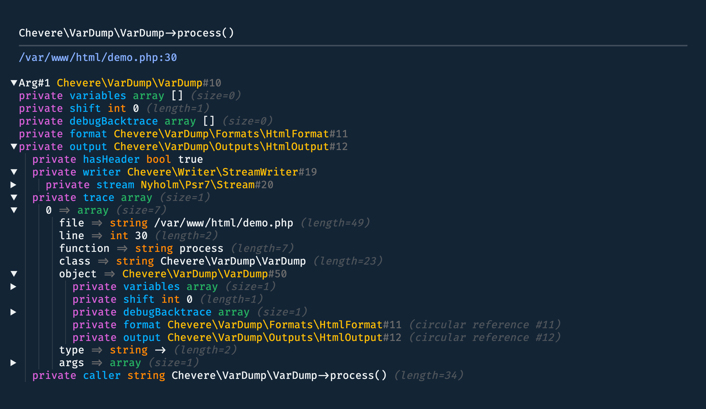

# VarDump

> 🔔 Subscribe to the [newsletter](https://chv.to/chevere-newsletter) to don't miss any update regarding Chevere.


[](https://github.com/chevere/var-dump/actions)

[](LICENSE)
[](https://phpstan.org/)
[](https://dashboard.stryker-mutator.io/reports/github.com/chevere/var-dump/2.0)

[](https://sonarcloud.io/dashboard?id=chevere_var-dump)
[](https://sonarcloud.io/dashboard?id=chevere_var-dump)
[](https://sonarcloud.io/dashboard?id=chevere_var-dump)
[](https://sonarcloud.io/dashboard?id=chevere_var-dump)
[](https://sonarcloud.io/dashboard?id=chevere_var-dump)
[](https://sonarcloud.io/dashboard?id=chevere_var-dump)
[](https://www.codefactor.io/repository/github/chevere/var-dump)

## Summary

Multi-purpose colorful modern alternative to [var_dump](https://www.php.net/manual/function.var-dump.php). It's a PHP library that provides an alternative to `var_dump` and `dump` functions. It's designed to be used in development environments to help you debug your code.

## Features

* Colorful output with automatic light/dark modes
* HTML, Console, and Plain text output
* No JavaScript required
* Displays modifiers, types, values, references, and more
* Recursive detection
* Foldable arrays and objects with indentation display
* Lightweight codebase

## Installing

VarDump is available through [Packagist](https://packagist.org/packages/chevere/var-dump) and the repository source is at [chevere/var-dump](https://github.com/chevere/var-dump).

```sh
composer require --dev chevere/var-dump
```

## Quick start

* Use `vd` to dump information about any variable (replaces `var_dump` and `dump`)
* Use `vdd` to do the same as `vd` and `die(0)` (replaces `dd`)

```php
vd($myVar); // var dump
vdd($myVar); // var dump and die
```

## Demo




* [HTML](https://chevere.github.io/var-dump/demo/output/html.html)
* [Plain text](https://chevere.github.io/var-dump/demo/output/plain.txt)
* [Console (asciinema)](https://asciinema.org/a/496889)

## Documentation

Documentation is available at [chevere.org](https://chevere.org/packages/var-dump).

## License

Copyright [Rodolfo Berrios A.](https://rodolfoberrios.com/)

Chevere is licensed under the Apache License, Version 2.0. See [LICENSE](LICENSE) for the full license text.

Unless required by applicable law or agreed to in writing, software distributed under the License is distributed on an "AS IS" BASIS, WITHOUT WARRANTIES OR CONDITIONS OF ANY KIND, either express or implied. See the License for the specific language governing permissions and limitations under the License.
